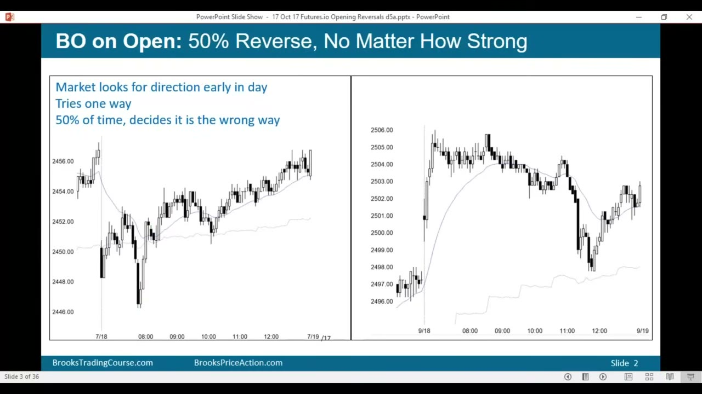
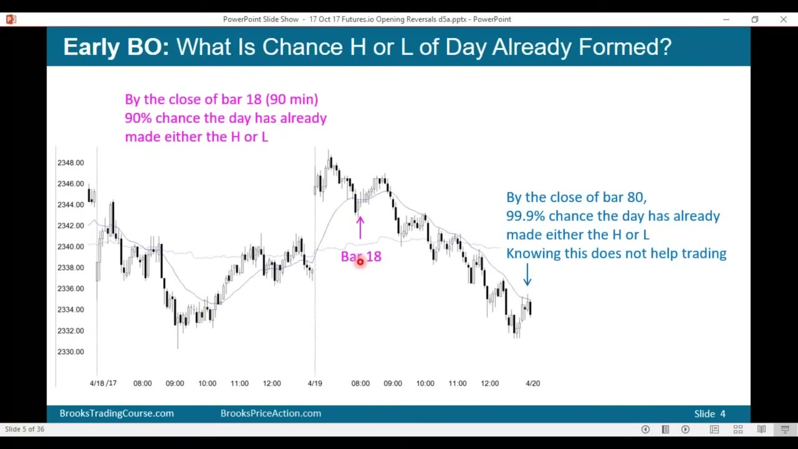
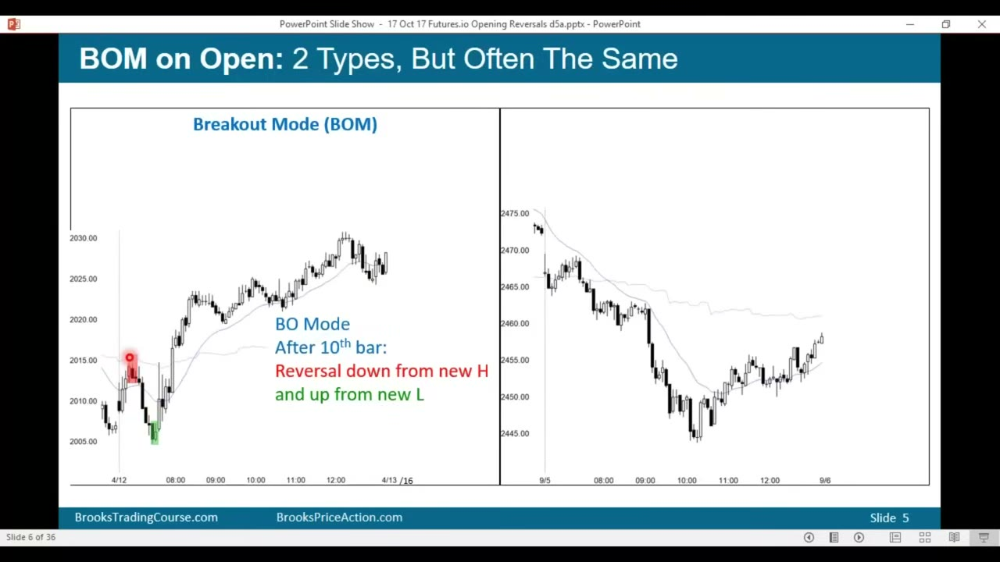
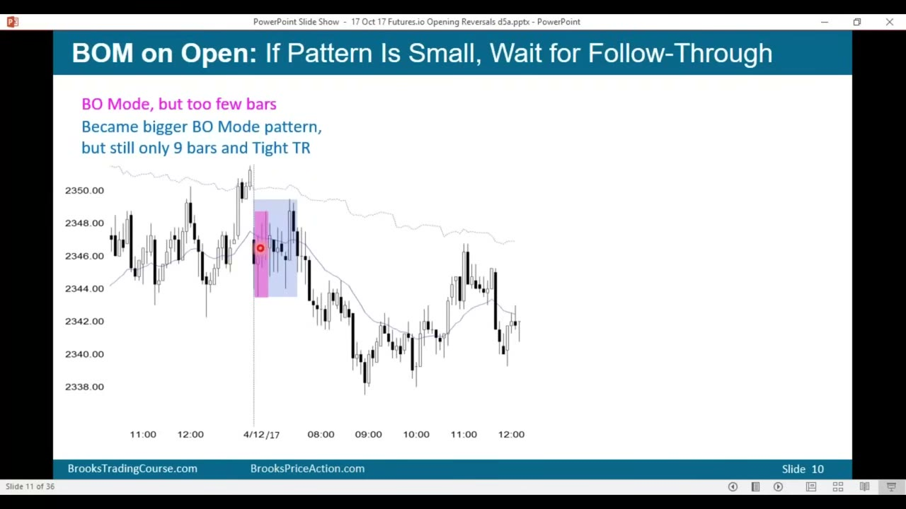
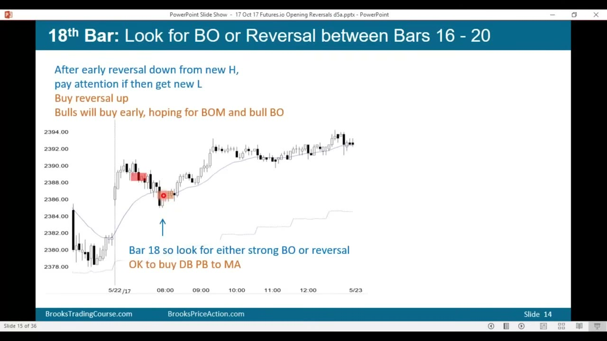
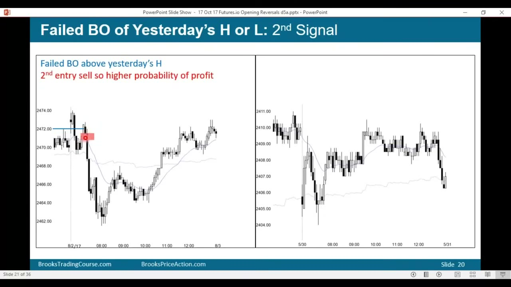
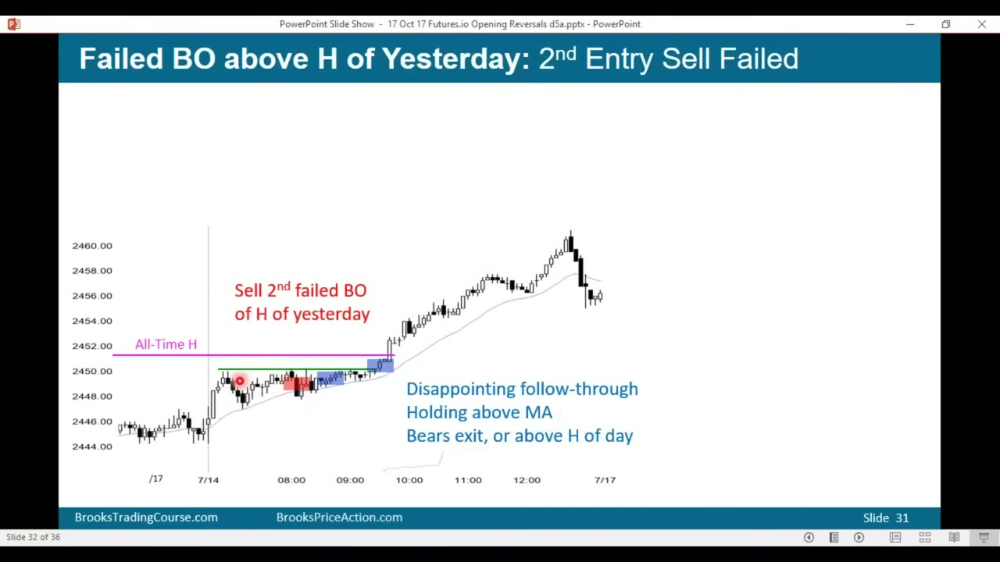

# exemplars/ — setup 参考图

> **版权**:下列图片为 Al Brooks *Trading Opening Breakouts & Reversals*(Brooks Trading Course,YouTube `yGDYNoY3b68`)的**幻灯片截图,版权归 Al Brooks**,此处仅作**私人学习参考**并标注出处。
> **长期方向**:逐步用**我们自己从历史 MES 数据渲染的标注图**替换(对齐 vision-from-data)。repo 公开 / 商用前务必替换或取得授权。

来源:https://www.youtube.com/watch?v=yGDYNoY3b68

## 图集

### opening-breakout-50pct-reversal · Slide 2 · 02:41

### high-low-of-day-forms-early · Slide 4 · 05:18

### opening-breakout-mode · Slide 5 · 07:26

### tight-range-fade · Slide 10 · 14:55

### opening-18bar-range-breakout · Slide 14 · 21:42

### failed-breakout-yesterday-2nd-entry · Slide 20 · 31:06

### opening-trend-resumption · Slide 31 · 41:08

